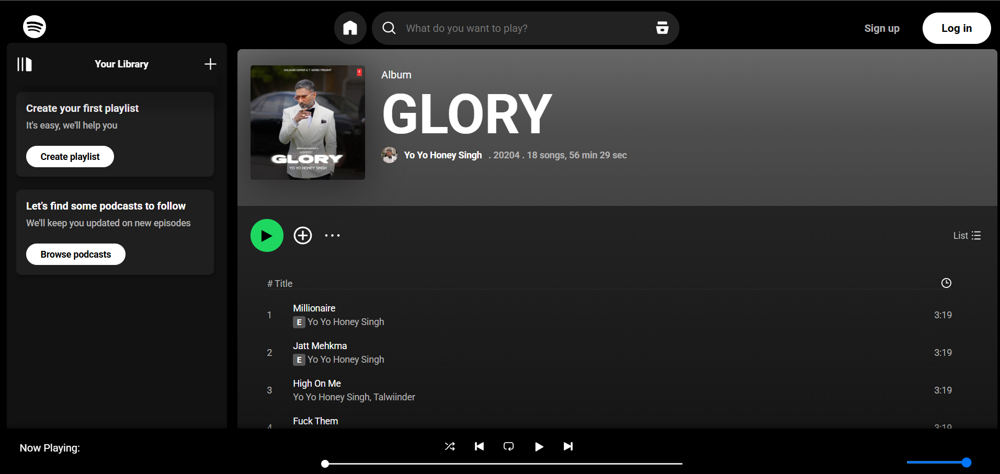

# 🎵 Spotify Clone

A fully functional **Spotify-inspired music player** built using **HTML, CSS, and JavaScript**. Enjoy a sleek UI, seamless playback, shuffle and loop controls, volume adjustments, and more — all in the browser!

👉 **[Live Demo on Vercel]([https://sppoootify.vercel.app/](https://vercel.com/soham-chavans-projects/spotifyclone-fe))**

---

## 📸 Demo


*Home screen showing the song list and controls*


*Now playing screen with seekbar, volume, and loop/shuffle toggles*

---

## ✨ Features

- 🎧 Play and pause songs
- ⏭ Next & ⏮ Previous track control
- 🔀 Shuffle feature to play random tracks
- 🔁 Loop the currently playing song
- 🔊 Volume control with smooth slider
- ⏱ Real-time seekbar and playback time display
- ⚡ Smooth, modern UI design
- 📱 Responsive layout (mobile-friendly)
- 🚀 Hosted live on **Vercel**

---

## 🛠️ Tech Stack

- **HTML5** – Structure of the page  
- **CSS3** – Styling and responsiveness  
- **JavaScript (Vanilla)** – Interactive features  
- **Vercel** – Deployment platform

---

## 🚀 Run Locally

To run the project on your local machine:

1. **Clone the repository**
   ```bash
   git clone https://github.com/sohamchavan-dev/spotify-clone.git
   cd spotify-clone
